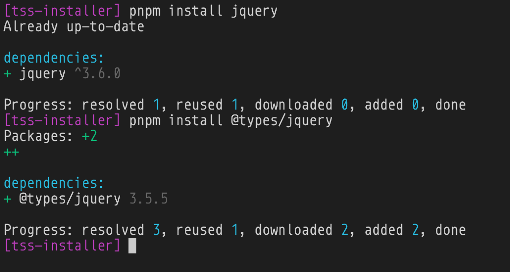
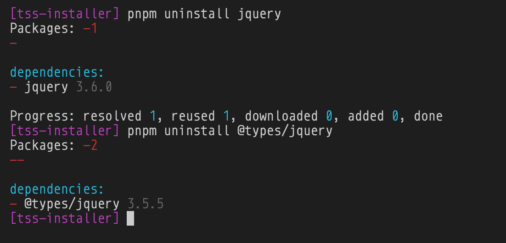
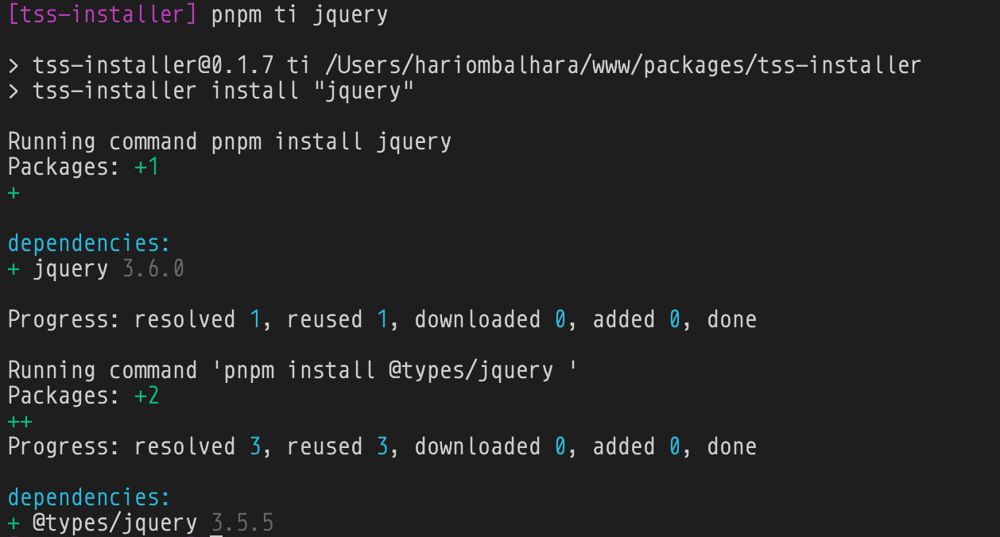
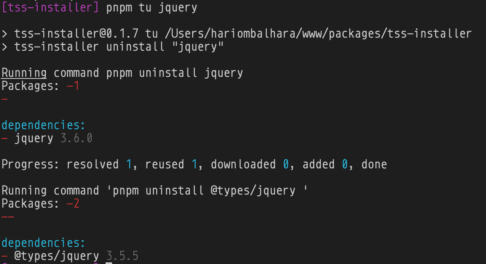

# Install Packages with their types

Ever installed a package to later find out that you don't have that package's @typings/ installed ? If yes, this is the solution for that.

## How to Install

1. `npm install tss-installer`
2. `Update package.json to add two scripts.`
    ```json
        "scripts": {
            "ti": "tss-installer install",
            "tu": "tss-installer uninstall"
        }
    ```

### How to use

- To install a package with it's typings

    ```bash
    npm run ti PACKAGE_NAME --save-dev # Supports same flags as npm
    ```
    
    or

    ```bash
    pnpm ti PACKAGE_NAME --save-dev #Supports same flags as pnpm
    ```

    or

    ```bash
    yarn ti PACKAGE_NAME -d # Supports same flags as yarn
    ```

- To uninstall a package and it's typings

    ```bash
    npm run tu PACKAGE_NAME
    ```

    or

    ```bash
    pnpm tu PACKAGE_NAME
    ```
    
    or

    ```
    yarn tu PACKAGE_NAME
    ```
## Demo

### Earlier

Installation


Uninstallation


### Now 

Installation

Uninstallation
